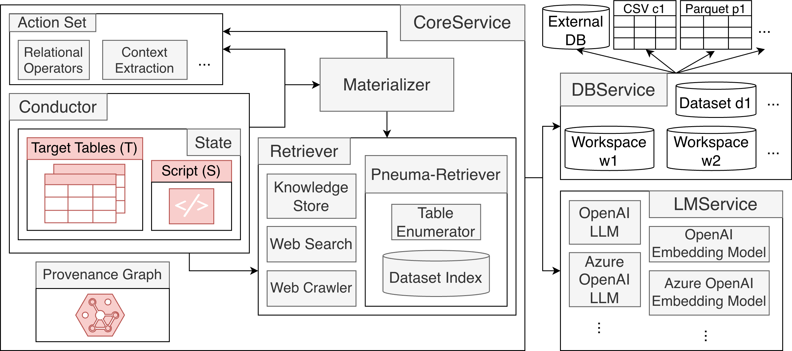

# Pneuma-Seeker

A system that helps users identify and fulfill their latent information needs.

## Running the system

```bash
conda create --name pneuma_seeker python=3.12.9
pip install -r requirements.txt
cd src/pneuma_seeker
nohup fastapi dev server.py >> server.out &
```

## Testing the system (ongoing)

```bash
cd ./tests/pneuma_seeker
python -m coverage run -m unittest discover
python -m coverage html
```
