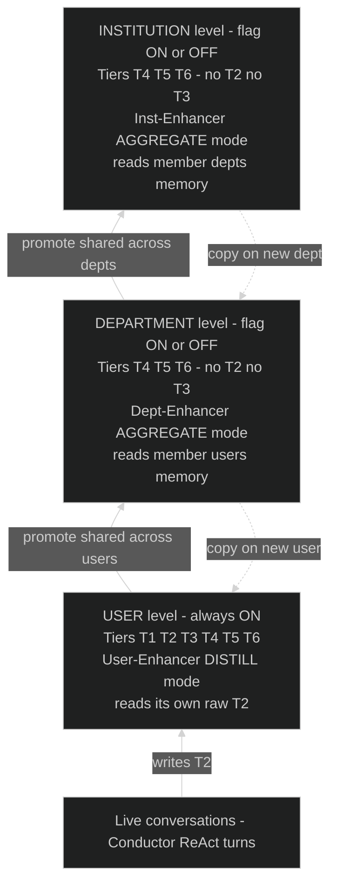

# Memory Architecture — Levels × Tiers — Design (LOCKED v1)

> Status: **LOCKED 2026-06-13 (DECISIONS D20).** This is the **architecture-level design** for the
> memory layer — the *third axis* of the design, parallel to the per-tier specs (`tierN-*-design.md`,
> the *kinds* of knowledge) and the writer spec (`enhancer-design.md`, the *verb*). This doc owns the
> **Level × Tier matrix** and the holder/promotion/copy/flag semantics. Refines D13/D14/D15.
>
> **Build status (important):** only the **User level** is on the build path — its cells are built
> per the `tierN-*-design.md` + `enhancer-design.md` specs. The **Department / Institution** levels
> and the **AGGREGATE/PROMOTE** Enhancer mode are the **design target but DEFERRED** (MVP = User
> level only, D20); the per-level mechanics below (bootstrap-copy, promotion counting, re-sync) are
> specified at *architecture* granularity here, **not** as a v1 build spec, and several details live
> in `BACKLOG.md`. Audience: teammates / reviewers needing the big picture.

## One paragraph

The memory layer is a **recursive hierarchy of memory holders**: a **User**, a
**Department**, and an **Institution**. Each holder owns its own memory and its own
background writer (the **Enhancer**). Raw experience is recorded **only at the User level**
(only users talk to the system); knowledge then flows **up** by distillation + promotion,
and **down** by copy when a new holder is created. The Department and Institution levels are
**optional, flag-gated layers**: with them off, the system is exactly today's single-user
Pneuma plus personal memory.

## The key idea: two orthogonal axes

The thing that makes this easy to reason about is keeping two axes separate:

- **Tier (T1–T6) = the *kind* of knowledge.**
  T1 reasoning buffer · T2 raw episodic log · T3 about-a-person · T4 conventions/definitions
  · T5 schema & join knowledge · T6 method skeletons.
- **Level = *whose* / *what scope* the knowledge is held at.**
  User · Department · Institution.

A concrete store is one cell: **(Level, Tier)** — e.g. `(User, T5)`, `(Department, T4)`.
"A user also has a T4" is not a contradiction: the **tier** says *kind* (conventions), the
**level** says *scope* (this user's own version of them).

## Diagram



ASCII fallback (same flows; `═▲` = promote up, `· ▼` = copy down):

```
   ┌──────────────────────────────────────────────┐
   │  INSTITUTION level            [flag ON/OFF]    │
   │  T4 T5 T6   (no T2, no T3)                     │
   │  Inst-Enhancer = AGGREGATE                     │
   └──────────────────────────────────────────────┘
        ║ promote                    · copy on
        ║ (shared across depts)      · new dept
        ║                            ▼
   ┌──────────────────────────────────────────────┐
   │  DEPARTMENT level             [flag ON/OFF]    │
   │  T4 T5 T6   (no T2, no T3)                     │
   │  Dept-Enhancer = AGGREGATE                     │
   └──────────────────────────────────────────────┘
        ║ promote                    · copy on
        ║ (shared across users)      · new user
        ║                            ▼
   ┌──────────────────────────────────────────────┐
   │  USER level                   [always ON]     │
   │  T1 T2 T3 T4 T5 T6                             │
   │  User-Enhancer = DISTILL  (reads raw T2)       │
   └──────────────────────────────────────────────┘
        ▲ writes T2
        │
   ┌─────────────┐
   │  Conductor   │  live conversation, ReAct turns
   └─────────────┘  (frontline: READ-only to all memory)
```

## Level × Tier matrix

| | T1 buffer | T2 episodes | T3 person | T4 conventions | T5 schema | T6 method | Enhancer input |
|---|---|---|---|---|---|---|---|
| **User** | ✓ (conversation) | ✓ (own) | ✓ | ✓ (own version) | ✓ (own) | ✓ (own) | its own raw **T2** |
| **Department** | — | — | — | ✓ | ✓ | ✓ | member **users'** memory |
| **Institution** | — | — | — | ✓ | ✓ | ✓ | member **depts'** memory |

- **T2 (raw) only at User level** — only users converse, so only they generate raw trajectories.
- **T3 (about a person) only at User level** — a department/institution is not a person.
- **T4–T6 at every level** — each level keeps its own version; a user's version = what it
  inherited (copied) **plus** what its own Enhancer has discovered but not yet had promoted up
  (this not-yet-promoted slice is the tribal knowledge extracted from *that user's* experience).

## The Enhancer: one algorithm, two modes

The Enhancer is the **only writer** of persistent memory; frontline agents (Conductor,
Retriever, Materializer) are **read-only**. It runs as one instance per level, sharing one
core (cluster → recurrence-gate → 4-branch update), differing only in how raw its input is:

- **DISTILL mode (User-Enhancer):** input is **raw T2** (messy, includes failures). Needs the
  eligibility gate + LLM distillation to turn dirty traces into clean lessons, then writes the
  user's own T3–T6.
- **AGGREGATE / PROMOTE mode (Dept- & Inst-Enhancer):** input is the level-below's
  **already-distilled** memory. No eligibility gate (input is already clean). Its job is to find
  **what enough members share** and **promote** it to this level.

"Common enough" is the same idea at every level; only the counting unit changes: at the User
level it is *how often one person repeats it*; at the Department level it is *how many users
share it*; at the Institution level, *how many departments share it*.

## Data flow

- **Up (promote):** a lesson is born local (User), and is pulled up to Department when shared
  across users, and up to Institution when shared across departments. This is the "promotion
  ladder." Authored/authoritative knowledge (external KB) is the exception — it is ingested
  directly at Department/Institution and never born at the User level.
- **Down (copy on bootstrap):** when a new user is created it **copies** its department's
  memory as a starting brain (and a new department copies the institution's). This is a
  **snapshot at creation**; the user then evolves it independently. Re-syncing a stale copy
  when the parent later improves is deferred (BACKLOG).
- **Read (inject):** because of copy semantics, at query time the Conductor reads only the
  **User-level** tiers — they already contain the copied parent knowledge. No live cross-level
  composition is needed at read time.

## The on/off switch (graceful degradation)

The **User level is always on** and equals today's single-user Pneuma plus a personal memory.
The **Department and Institution levels are additive and flag-gated** (same `ENABLE_MEMORY_*`
pattern, default off):

- **Off:** no aggregate Enhancer, no bootstrap copy — just the User level. Identical to current
  Pneuma; nothing to mis-adapt.
- **On:** the aggregate/promote machinery and new-holder bootstrap-copy activate.

Because users **own** their (copied, then independent) memory, turning the higher levels off
never strips anything from existing users.

## What the MVP builds (and what it defers)

The flag boundary is also the milestone boundary:

- **MVP = User level only** (i.e. Department/Institution **OFF**). Close the smallest learning
  loop end-to-end for **one persona**:
  `live conversation → T2 capture → User-Enhancer (distill) → write a User T3 record →
  next conversation injects it → observable behaviour change`.
- **Deferred to a later milestone:** the Department/Institution levels and the
  AGGREGATE/PROMOTE Enhancer. Their input (user memory) does not exist until the User level
  works, so there is a natural build order.

The three-level hierarchy is the **design target**; we build the bottom level first, and the
higher levels are "more of the same" turned on later.
